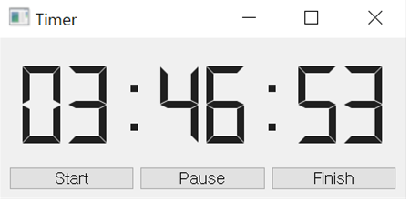
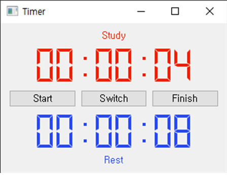

# Stopwatch
Various Stopwatch for Study.(Python with PyQt5)

I refer code from https://www.inflearn.com/questions/23977
If it occurs legal problem, deleted.

## Stopwatch_One.py
  
This is a normal stopwatch.
This has Start, Pause, Finish Buttons.  

## Stopwatch_Twin.py
  
This is Stopwatch which has not a Pause but Switch.  
There is Red(Study), Blue(Rest) timer which are exclusive.  
One starts, the other one stops.  
And when the Finish Button clicked, both timer stop and Finish Button becomes Reset.  
  
I hope this helps you guys!  

  
Ps. ShorKey
+ Key 'Esc' is Exit
+ Key 'C' is switch
